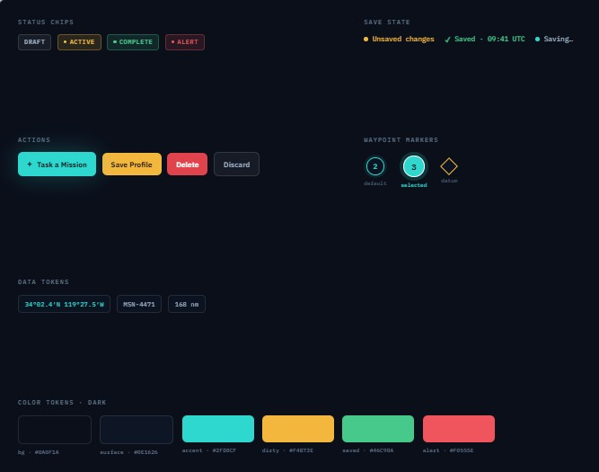
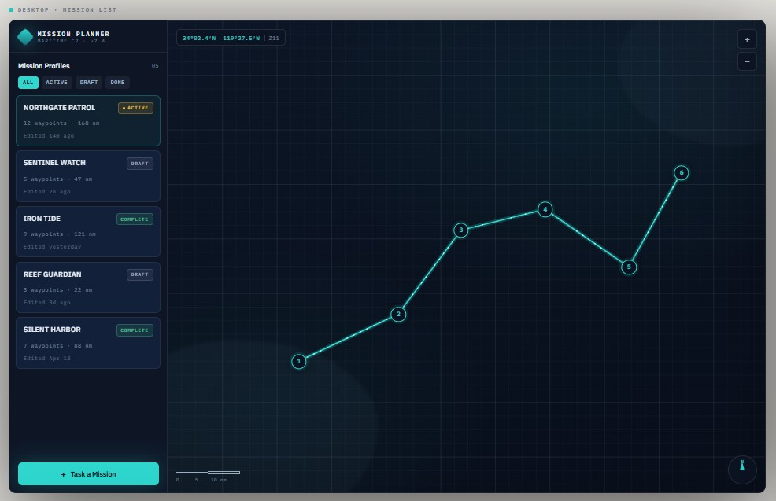
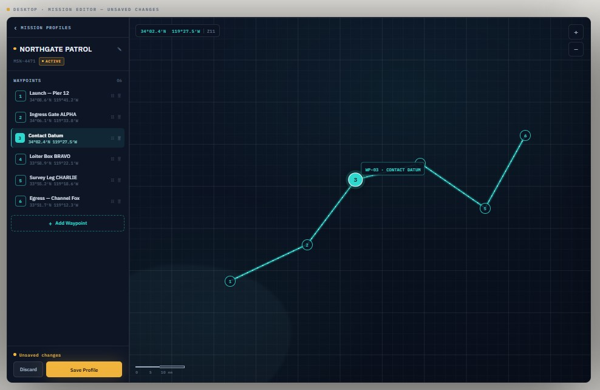
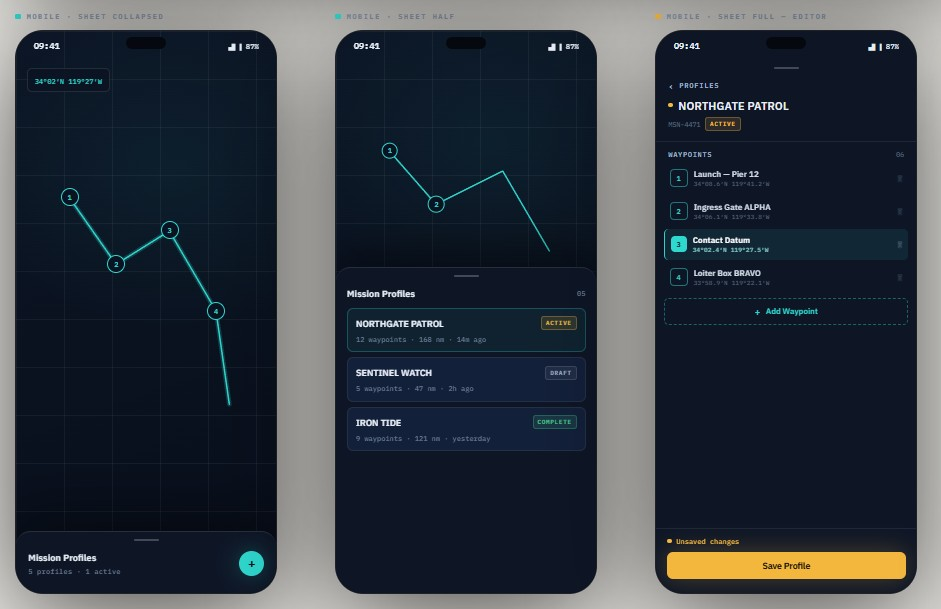

# Mission Planner | Maritime C2

A mission planning application for autonomous surface vessels. Users create mission
profiles, plot ordered waypoints on a Mapbox map, edit the route, and save. Missions
persist client-side via `localStorage`.

Built with React 19, TypeScript, Vite, and `react-map-gl` (Mapbox GL JS).

**[Live demo](https://mission-planner-sigma.vercel.app/)**, deployed on Vercel.

## Setup

A Mapbox access token is required. Create one at mapbox.com and add it to `.env` as
`VITE_MAPBOX_TOKEN`. The token is read at build time and is not committed (`.env` is
gitignored).

```bash
npm install
npm run dev
```

## How to use

- **Task a Mission** creates a new profile and opens it in the editor.
- **Add Waypoint** enters placement mode - click the map to drop a waypoint, ESC cancels.
- Drag markers to reposition, or edit coordinates directly in the waypoint row.
- Click a waypoint row or its marker to select it (selection syncs both ways).
- Drag the row grip handles to reorder the route sequence.
- **Save Profile** persists changes; **Discard** reverts to the last saved state.
- Filter the mission list by status, or export/import a mission as JSON.

## Required features

| Requirement | Implementation |
|---|---|
| Mission list | Left rail listing all missions with name, status, waypoint count, and route distance. Create and select from the list. |
| Mission editor | Mapbox map with numbered markers connected by a route line. Add (placement mode), move (drag or coordinate entry), delete, and rename waypoints. |
| Save mission | Explicit Save/Discard. Persisted to `localStorage`. Unsaved changes shown via an amber indicator; a `beforeunload` guard warns on tab close while dirty. |
| Responsive UI | Two-pane desktop layout; on mobile the rail becomes a bottom sheet with collapsed / half / full detents, keeping the map unobstructed. |

## Bonus features (from the brief)

- **Waypoint reordering** via drag-and-drop (`@dnd-kit`), reflected live in the route.
- **Mission status** indicators (Draft / Active / Complete) settable from list and editor.
- **Empty and error states**: a first-run empty state, an empty-filter state, a
  `localStorage` safe-parse fallback, and a React error boundary around the app.
- **Import / export** missions as JSON.

## Additions for this domain

A few things outside the brief that fit a maritime C2 tool and were low-cost to add:

- **Great-circle distance.** Haversine distance per leg in the waypoint list and total
  route distance (in nautical miles) in the editor and list.
- **Nautical scale bar** on the map, computed from zoom and latitude.
- **Per-mission route colors** so overlapping active routes stay distinguishable on the map.

## Design decisions

- **Google Maps drill-in pattern.** A single left rail switches between the mission list
  and the editor with no router and no page transitions, keeping interaction in one view.
- **Dark naval palette.** Red is reserved strictly for destructive and alert states, so
  color carries operational meaning rather than decoration.

## Design mock-ups

- **Iterative approach.** I started with a theme and design principals to follow, and 
  then iterated on them once it was living in code and I could judge the look and feel.
- The design documents are linked below.

<details>
<summary>Documents</summary>

**Visual Identity**



**Desktop**




**Mobile**



</details>

## Architecture

```
src/
├─ App.tsx                 # top-level state wiring
├─ hooks/useMissions.ts    # mission CRUD, working-copy/dirty logic, persistence
├─ lib/
│  ├─ types.ts             # Mission / Waypoint / status / color types
│  ├─ storage.ts           # safe localStorage read/write
│  ├─ coords.ts            # decimal ↔ DDM formatting
│  └─ distance.ts          # haversine + route distance
└─ components/             # Rail, MissionList, MissionEditor, WaypointRow,
                           # MapCanvas, MobileSheet, SaveBar, modals, states
```

## Notes on tooling

Built in WebStorm with Claude Code. I worked design-first, a visual mockup
established the layout and palette, then a written spec drove implementation,
which I reviewed and refined. AI handled scaffolding and boilerplate. The
architecture, scope decisions, and interaction logic were mine.

## What I'd add in production

- Backend persistence and auth, replacing `localStorage`.
- Unit testing coverage
- A light theme: the palette is already tokenized as CSS custom properties, so the
  swap is simple.
- Vehicle simulation: animate a vessel along the route with progress and ETA from the
  per-leg distances already computed.
- A full keyboard-accessibility pass: ARIA roles, focus management, screen-reader testing.
- Coordinate validation against navigable water and waypoint-to-waypoint feasibility.
